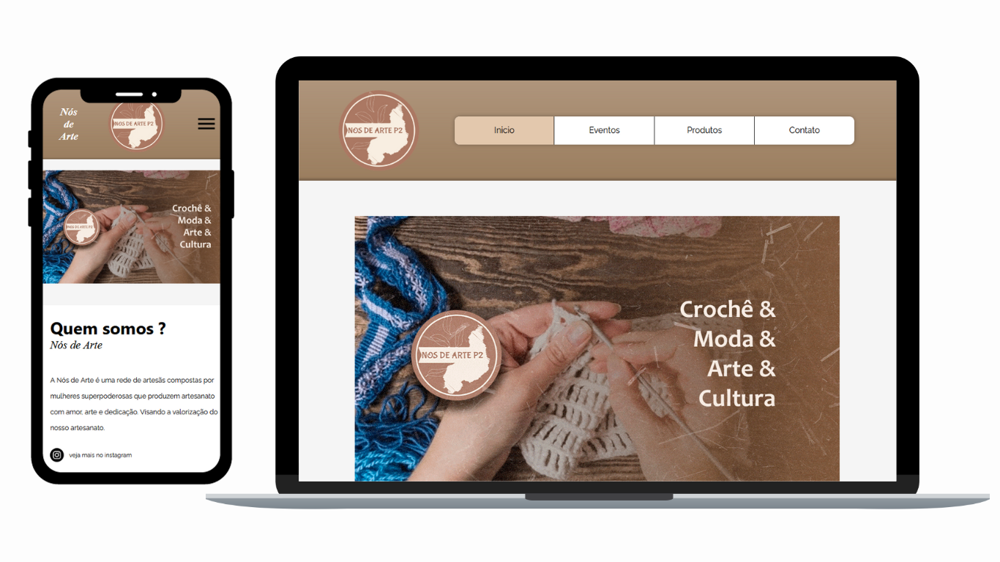

<h1 align="center"> Nós de Arte </h1>

 
 

Este website é baseado em um projeto anterior, feito atravéis da plataforma <a href="https://www.google.com/url?sa=t&rct=j&q=&esrc=s&source=web&cd=&cad=rja&uact=8&ved=2ahUKEwjjpNznr6ODAxXYppUCHUNXA7wQFnoECAYQAQ&url=https%3A%2F%2Fpt.wix.com%2F&usg=AOvVaw02HBUd4W0y6MSj0RppCBXq&opi=89978449">wix.com</a> para um projeto de exibição durante um evento da faculdade, agora sendo feito a "mão". Um breve resumo para contexto, a Nós de Arte é uma pequeno conjunto de artesãs de minha cidade, originalmente o projeto visava tornar o site um meio onde as mesmas poderiam apresentar e vender seus produtos, dentre outras ações realizadas pela equipe que seriam divulgadas por lá.

<h3>Tecnologias usadas:</h3>
<ul>
<li>Html</li>
<li>Css</li>
<li>JavaScript</li>
<li>Git</li>
</ul>

<h3>Também usados:</h3>
<ul>
<li>Canva (imagens)</li>
<li>Pexels (imagens)</li>
<li>GoogleFonts (fontes)</li>
<li>Flaticon (icones)</li>
<li>GitHubPages (hospedagem)</li>
</ul>

<h3>Demais Colaboradores:</h3>
<ul>
<li><a href="https://www.linkedin.com/in/valfredo-silva-593701233?lipi=urn%3Ali%3Apage%3Ad_flagship3_profile_view_base_contact_details%3ByRBp%2FDOVSzCLi5v4whOOlA%3D%3D">Valfredo Silva</a></li>
<li><a href="https://www.linkedin.com/in/paulo-braga-5b225b243?lipi=urn%3Ali%3Apage%3Ad_flagship3_profile_view_base_contact_details%3BNipNelL1S8CY2MBomDoBiA%3D%3D">Paulo Braga</a></li>
<li><a href="https://www.linkedin.com/in/isaacdesigneer?lipi=urn%3Ali%3Apage%3Ad_flagship3_profile_view_base_contact_details%3BrTpPWlUbReyTnr48ZuCQ%2BQ%3D%3D">Francisco Isaac</a></li>
</ul>

<h3>Veja o resultado aqui:</h3>
<a href="https://pedrobarroso-n.github.io/nosdearte/" style="padding: 5px 30px;background: blue;color: black;">ACESSAR</a>

 
 
 
<a href="https://valfredocosta.wixsite.com/nosdearte" style="text-decoration: underline;">* clique para ver o projeto original</a>
